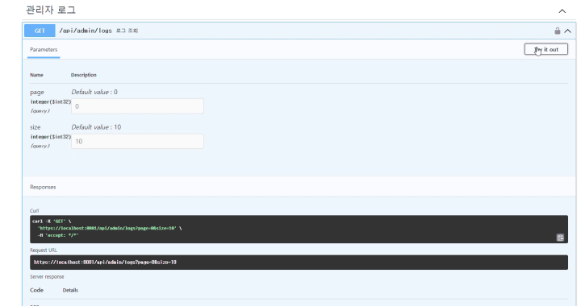

# 프로젝트 이름: 대구광역시 버스 API 활용

## 개요
저희 프로젝트는 버스 및 노선 관련 데이터를 관리하고 클라이언트(웹/앱)에 실시간 정보를 제공하는 REST API 기반의 프로젝트입니다. Spring Boot를 기반으로 개발되었으며, Redis와 JPA를 활용하여 데이터를 효율적으로 처리합니다.

---

## 주요 기능
- **노선 관리**: 노선 추가, 수정, 삭제 및 경유 정류소 관리
- **실시간 데이터 제공**: WebSocket을 통해 Redis 데이터를 실시간으로 대시보드에 전송
- **페이징 및 검색**: 노선 데이터를 페이징 및 검색 기능과 함께 제공
- **관리자 기능**: 관리자 권한으로 노선 및 정류소 데이터 관리
- **OAuth2 인증**: Kakao 및 Google OAuth2를 통한 인증 지원
- **Swagger UI**: API 문서화 및 테스트 지원
- **분실물/습득물 및 매칭관리**: 일반회원의 분실물 신고, 버스회사 관리자의 습득물 등록, 양방향 매칭 및 상태 관리
- **광고/공지 팝업 시스템**: 배너/팝업 광고와 공지사항 팝업 등록 및 기간제한
- **Q&A 관리**: Q&A 상태 자동 전환 및 답변 기능
- **로그 추적**: @AdminTrack, @AdminAudit 기반 관리자 작업 로그 기록 시스템 구축

---

## 기술 스택
- **백엔드**: Java, Spring Boot
- **데이터베이스**: Redis, JPA (Hibernate)
- **빌드 도구**: Maven
- **API 문서화**: SpringDoc (Swagger)
- **실시간 통신**: WebSocket
- **보안**: Spring Security, OAuth2

---

## 설치 및 실행

### 1. 필수 요구사항
- Java 17 이상
- Maven 3.8 이상
- Redis 서버 실행 중
- 데이터베이스 설정 (JPA 및 Redis)

### 2. 프로젝트 클론
```bash
git clone https://github.com/heeha153/bus2.git
cd bus2
```

### 3. 환경 설정
`src/main/resources/application.properties` 파일을 수정하여 환경 설정을 업데이트합니다:
- Redis 설정 (`spring.data.redis.host`, `spring.data.redis.port`)
- OAuth2 설정 (Kakao, Google)
- 파일 업로드 경로 (`file.upload.found-location`, `file.upload.ad-location`)

### 4. 빌드 및 실행
```bash
mvn clean install
mvn spring-boot:run
```

## API 문서 구조

본 프로젝트의 Swagger 문서는 `GroupedOpenApi`를 활용하여 기능별로 명확하게 분리되어 있습니다. 이를 통해 외부 개발자 또는 팀원들이 필요한 API를 쉽게 찾고 테스트할 수 있도록 구성되어 있습니다.

### 주요 그룹
- **노선/정류소 관리** (`/api/bus/**`)
- **시간표 및 저상버스 관리** (`/api/schedule/**`)
- **버스 요금 관리** (`/api/fares/**`)
- **노선별 주요 정류장 지정** (`/api/schedule-headers/**`)
- **관리자 기능** (`/api/admin/**`) - 공지사항, 습득물/분실물 관리, 광고관리 등 
- 공지사항 관리 (`/api/notice/**`) - 공지사항 등록, 수정, 삭제
  
- 분실물/습득물 매칭 API 시연  
    `/api/admin/found/match/{foundItemId}` (POST): 습득물 기준으로 분실물 매칭 및 회수 처리  
    
- 광고 등록 API 시연  
  `/api/ad` (POST): 배너/팝업 광고 등록 및 기간 설정, 광고회사 연동  
  
- **로그 기록 조회** (`/api/logs/**`) - Redis, Query, API 로그 조회
  


> Swagger UI: [http://localhost:8081/swagger-ui.html](http://localhost:8081/swagger-ui.html)

---

## 관리자 API 사용 안내
- 관리자 페이지 접근은 `ROLE_ADMIN` 권한을 요구합니다.
- OAuth2 로그인 후 관리자 권한이 있는 계정만 접근 가능합니다.
- 주요 기능: 공지사항 등록, 습득물/분실물 처리, 광고관리, 통계 조회, 로그 관리 등
  
---

## 개발 환경
- **IDE**: IntelliJ IDEA 2024.3.5
- **운영 체제**: Windows
- **빌드 도구**: Maven

---

## 기여
1. 이슈를 생성하여 버그 또는 새로운 기능 요청
2. Pull Request를 통해 코드 기여

---

## 라이선스
이 프로젝트는 MIT 라이선스를 따릅니다. [LICENSE](LICENSE) 파일을 참조하세요.
