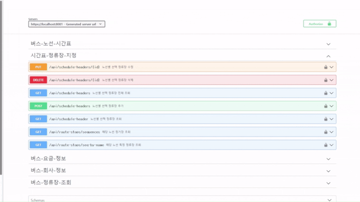

# 프로젝트 이름: 대구광역시 버스 API 활용

## 개요
저희 프로젝트는 버스 및 노선 관련 데이터를 관리하고 클라이언트(웹/앱)에 실시간 정보를 제공하는 REST API 기반의 프로젝트입니다. Spring Boot를 기반으로 개발되었으며, Redis와 JPA를 활용하여 데이터를 효율적으로 처리합니다.

---

## 🎯 주요 기능

대구광역시 버스 시스템은 일반 사용자, 버스회사 관리자, 시스템 관리자 역할을 기반으로 다음과 같은 기능을 제공합니다.

---


### 🛠 관리자 기능

#### 🗂 게시글 관리
- 공지사항 등록/수정/삭제 및 팝업 설정
- 광고 등록 (배너/팝업), 광고회사 연동 및 기간 설정
- Q&A 답변 등록 및 상태 전환, 통계 확인

#### 🎒 분실/습득물 관리
- 일반회원이 신고한 분실물 목록 확인 및 숨김 처리
- 버스회사 관리자의 습득물 등록, 수정, 삭제
- 습득물-분실물 매칭 처리 (상태 자동 전환)
- 분실/습득 통계 및 자동 숨김 스케줄러

#### 🚌 노선 관리
- 노선 등록, 수정, 삭제
- 노선별 정류장 연결 및 순서 설정
- 노선별 페이징, 검색 기능

#### 🏁 정류장 관리
- 정류장 등록, 수정, 삭제, 조회

#### 🕒 운행시간 관리
- 노선별 첫차/막차, 배차 간격 등록 및 수정

#### ⚙ 시스템 관리
- 관리자 작업 로그 기록 (`@AdminAudit`, `@AdminTrack`)
- API 응답속도, Redis 캐시 통계 대시보드
- 길찾기 경로 설정 기능 (예정)

#### 📄 API 문서화
- Swagger UI 기반 API 테스트 환경
- 기능별 `GroupedOpenApi` 구성

---

### 👤 일반 사용자 기능 (일반회원)

- 분실물 신고 등록 및 조회
- Q&A 작성 및 내 문의 확인
- 습득물 목록 열람
- 공지사항, 팝업 광고 보기

---

### 🔐 인증 및 권한

- Kakao, Google OAuth2 기반 로그인
- 사용자 권한(Role)에 따라 관리자/버스회사/일반회원으로 구분
- 메뉴 및 API 접근 제어

---

## 💡 정리 포인트

- 모든 주요 기능은 **관리자 중심**으로 설계되어 있고,  
  일반회원은 일부 기능(신고, Q&A 등)만 접근 가능합니다.
- 기능은 **메뉴 구조 기준** + **실제 사용 권한 기준**으로 분리했습니다.

---

## 기술 스택
- **백엔드**: Java, Spring Boot
- **데이터베이스**: Redis, JPA (Hibernate)
- **빌드 도구**: Maven
- **API 문서화**: SpringDoc (Swagger)
- **실시간 통신**: WebSocket
- **보안**: Spring Security, OAuth2

---

## 설치 및 실행

### 1. 필수 요구사항
- Java 17 이상
- Maven 3.8 이상
- Redis 서버 실행 중
- 데이터베이스 설정 (JPA 및 Redis)

### 2. 프로젝트 클론
```bash
git clone https://github.com/rainsweetMina/tayotayo.git
cd bus2
```

### 3. 환경 설정
`src/main/resources/application.properties` 파일을 수정하여 환경 설정을 업데이트합니다:
- Redis 설정 (`spring.data.redis.host`, `spring.data.redis.port`)
- OAuth2 설정 (Kakao, Google)
- 파일 업로드 경로 (`file.upload.found-location`, `file.upload.ad-location`)

### 4. 빌드 및 실행
```bash
mvn clean install
mvn spring-boot:run
```


## API 문서 구조

 본 프로젝트의 Swagger 문서는 `GroupedOpenApi`를 활용하여 기능별로 명확하게 분리되어 있습니다. 이를 통해 외부 개발자 또는 팀원들이 필요한 API를 쉽게 찾고 테스트할 수 있도록 구성되어 있습니다.
---
### 주요 그룹

- **관리자 기능** (`/api/admin/**`)
   - 공지사항 관리
    (`/api/notice/**`) - 공지사항 등록, 수정, 삭제
https://github.com/user-attachments/assets/da98b9d3-1206-4c2b-a3a8-cf82240ba297

- 로그 기록 조회 (`/api/logs/**`) - Redis, Query, API 로그 조회
 
https://github.com/user-attachments/assets/cafc911b-7852-467b-ad57-9eccc98c5059

- API chart 조회 (`/api/logs/**`) - Redis사용량, API 사용량 조회

https://github.com/user-attachments/assets/ac6871c0-9b24-49bf-98ba-3f76e71d473e


---
### Q&A 관리자용
- **경로**:
    - `PUT /api/qna/{id}/answer`, `PATCH /api/qna/admin/hide/{id}`, `GET /api/qna/admin/stats`,`GET /api/qna/admin`
- **기능**:
    - 사용자 문의에 대한 관리자 답변 등록
    - 비공개 Q&A 숨김 처리
    - 전체 Q&A 통계 조회
- **특징**:
    - 상태 자동 전환(`WAITING → ANSWERED`)
    - 답변 입력과 함께 관리자 정보 자동 연동
    - `isSecret`, `visible` 등을 통한 접근 제어 구현


---

### 3️⃣ 분실물/습득물 통합 관리 및 매칭 처리
- **경로**:
    - `POST /api/lost`, `GET /api/lost/visible`, `PUT /api/lost/{id}`, ...
    - `POST /api/admin/found`, `PATCH /api/admin/found/hide/{id}`, ...
    - `POST /api/admin/found/match/{foundItemId}`
- **기능**:
    - 일반회원: 분실물 등록 / 조회 / 수정 / 삭제
    - 버스회사 관리자: 습득물 등록 / 수정 / 숨김 / 삭제
    - 관리자: 습득물 기준으로 분실물 매칭 및 상태 전환 처리
- **특징**:
    - 분실물/습득물 등록 시 이미지 포함 가능
    - 게시글은 등록 후 7일 뒤 자동 숨김 처리 (Scheduler)
    - 매칭 시 상태 자동 변경 ('회수 완료') 및 '신고 없이 수령' 처리도 가능


---

### 광고 등록
- **경로**:
    - `POST /api/ad`, `PUT /api/ad/{id}`, `DELETE /api/ad/{id}`, ...
    - `POST /api/ad-company`, `GET /api/ad-company`, ...
- **기능**: 광고 등록 (배너 / 팝업), 기간 설정, 광고회사 연동
- **특징**:
    - 팝업 광고는 자동 종료 / 배너 광고는 상태별 필터링
    - 광고회사 드롭다운 연동


---

- **노선/정류소 관리** (`/api/bus/**`)
  
  
- **노선/정류소 관리** (`/api/bus/**`) <br/>

---
  
- **버스 요금 정보 관리** (`/api/fares/**`) & **버스 회사 정보 관리** (`/api/companies/**`)
  
  
- **시간표 및 저상버스 관리** (`/api/schedule/**`)
  
  
- **노선별 주요 정류장 지정** (`/api/schedule-headers/**`)
 

---

- **관리자 API키 관리** (`/api/admin/apikey`) - API키 발급, 삭제
  
  
- **사용자 관리** (`/api/management/user`) - User Role 조회, 수정
  
  
- **마이페이지 즐겨찾기** (`/api/mypage/favorite`) - 마이페이지 정류장/노선 즐겨찾기 조회, 수정, 삭제
  


> Swagger UI: [http://localhost:8081/swagger-ui.html](http://localhost:8081/swagger-ui.html)

---

## 관리자 API 사용 안내
- 관리자 페이지 접근은 `ROLE_ADMIN` 권한을 요구합니다.
- OAuth2 로그인 후 관리자 권한이 있는 계정만 접근 가능합니다.
- 주요 기능: 공지사항 등록, 습득물/분실물 처리, 광고관리, 통계 조회, 로그 관리 등
  
---

## 개발 환경
- **IDE**: IntelliJ IDEA 2024.3.5
- **운영 체제**: Windows
- **빌드 도구**: Maven

---

## 기여
1. 이슈를 생성하여 버그 또는 새로운 기능 요청
2. Pull Request를 통해 코드 기여

---

## 라이선스
이 프로젝트는 MIT 라이선스를 따릅니다. [LICENSE](LICENSE) 파일을 참조하세요.
